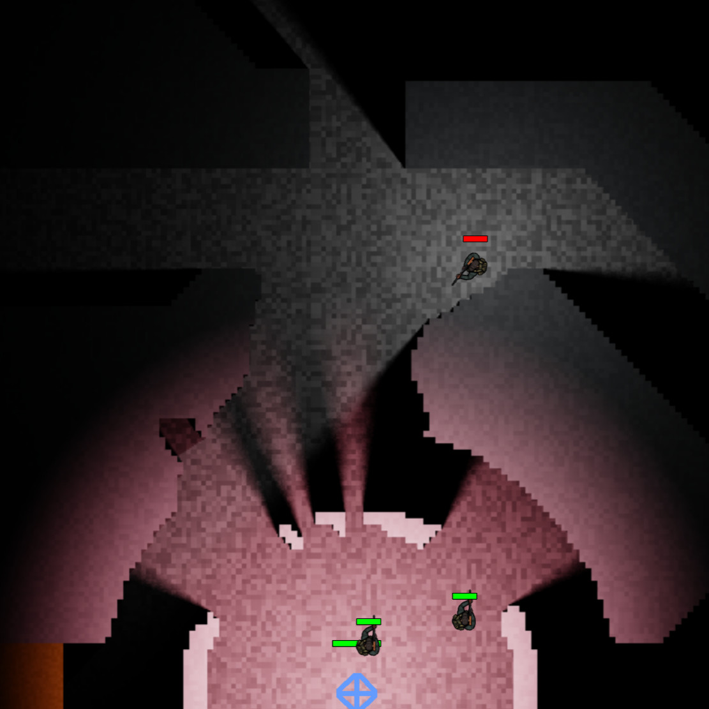
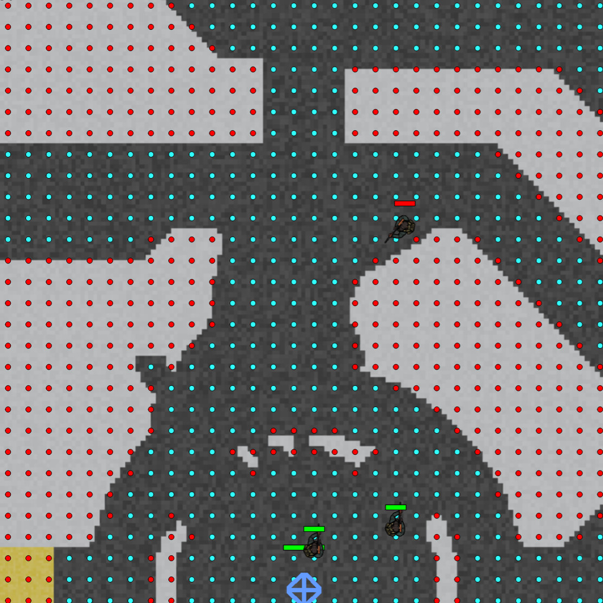
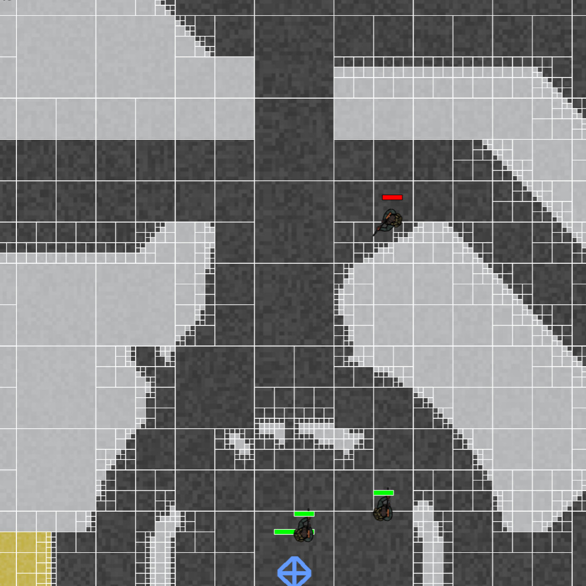
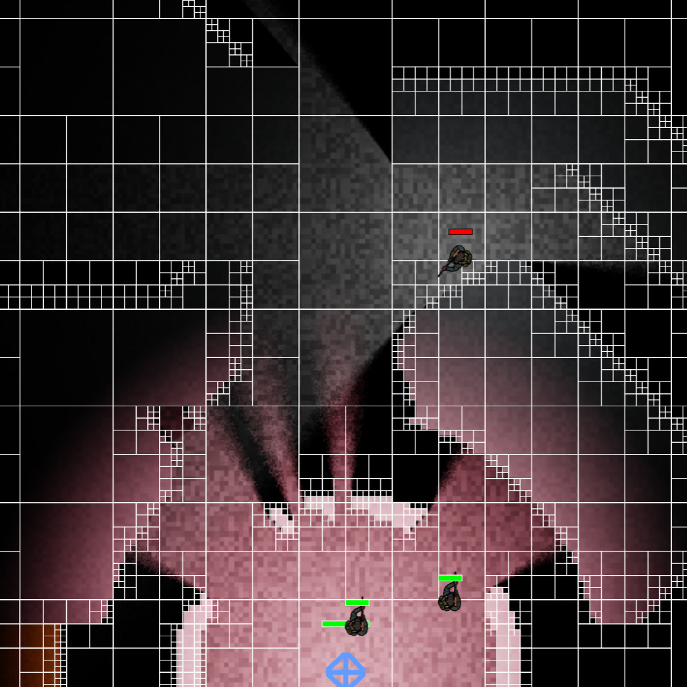

# Team G6 Jamtacular 2023

| | |
|-|-|
|||
|||

A small RTS game written during a game jam.

Features:
- Ray traced lighting.
- Destructible quadtree-based terrain.
- Autonomous NPC behaviours:
    - Pathfinding.
    - Raycasting for resource detection and collection.
